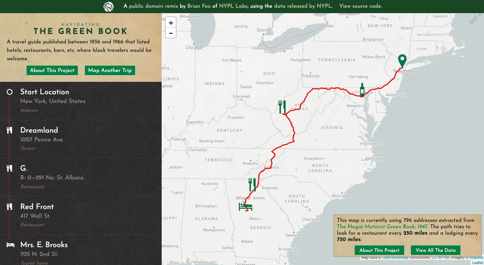

# Week 1 Thinking Cap

## Screenshot of the Site

## Link to the Site
https://publicdomain.nypl.org/greenbook-map/

## What is the site's agenda?
The website is based on the Green Book, which was a "travel guide published between 1936 and 1966 that listed hotels, restaurants, bars, etc. where black travelers would be welcome." It has an interactive map where the user can put the starting/ending destinations as if they are making a trip and it displays places that black travelers were allowed to stay in the route. 

## Why does the website speak to you? 
What I enjoyed most about this example was that it lets the users see for themselves the reality of what it must have been like to be black during the mid 1900s instead of explaining like a history book. The interactive setting where the user has control creates a more personal experience and makes the project memorable. 

## How does the mapping work, and does it work?
The data and the coordinates were extracted from the Green Book by using OCR. The map draws a red path from the starting and ending location the user has entered, while trying look for a restaurant every 250 miles and a lodging every 750 miles. The mapping does work but it only shows one route between cities. 

## What technologies does the map use?
The map uses OpenStreetMap, Mapbox, and Leaflet.

## If you could change something, what would it be?
I would add some kind of error handling feature because nothing happens when I enter an invalid address right now. The colors are also primarily red and green, which is not color-blind friendly. 

